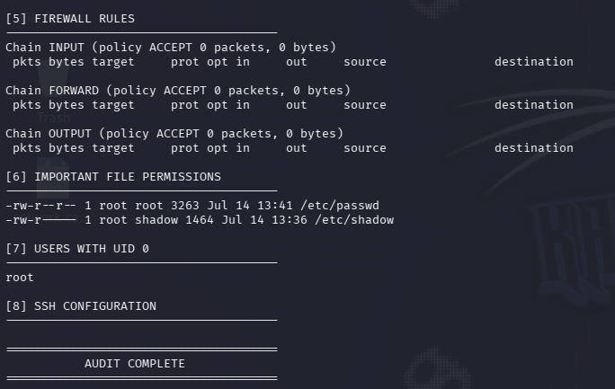
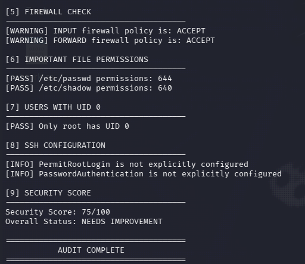
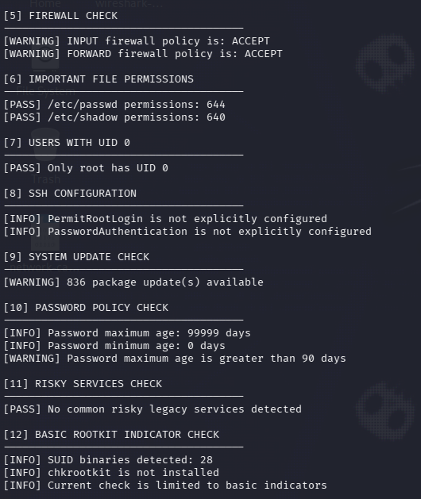
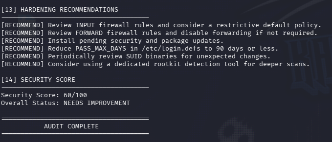

# Linux Hardening Audit Tool

A Bash-based Linux security auditing tool designed to assess common system security settings, identify potential weaknesses, and provide basic hardening recommendations.

This project was created as part of a cybersecurity internship project phase focused on Linux system hardening and defensive security.

## Objective

The purpose of this project is to audit a Linux system and evaluate important security areas such as:

- Firewall configuration
- Running services
- Listening ports
- Important file permissions
- UID 0 users
- SSH configuration
- System updates
- Password policy
- Risky legacy services
- Basic rootkit indicators

The tool also generates a basic security score and provides hardening recommendations based on the findings.

## Tools Used

- Bash
- Kali Linux
- iptables
- systemctl
- ss
- awk
- grep
- stat
- find
- Linux system configuration files

## Features

### System Information
Displays basic information about the Linux machine using `hostnamectl`.

### User Information
Displays the current user and user/group privileges.

### Listening Ports
Uses:

```bash
ss -tuln
```

to identify listening TCP and UDP ports.

### Running Services
Lists currently running system services using:

```bash
systemctl --type=service --state=running
```

### Firewall Check
Examines the default `iptables` INPUT and FORWARD policies.

The tool generates warnings when permissive policies such as `ACCEPT` are detected.

### Important File Permission Check
Checks permissions for:

```text
/etc/passwd
/etc/shadow
```

Expected secure values used by the tool include:

```text
/etc/passwd : 644
/etc/shadow : 640 or 600
```

### UID 0 Check
Identifies all users with UID 0.

Normally, only the `root` account should have UID 0.

### SSH Configuration Check
Examines:

```text
/etc/ssh/sshd_config
```

for:

```text
PermitRootLogin
PasswordAuthentication
```

### System Update Check
Checks how many package updates are currently available.

### Password Policy Check
Reads password aging settings from:

```text
/etc/login.defs
```

including:

```text
PASS_MAX_DAYS
PASS_MIN_DAYS
```

### Risky Services Check
Checks for common legacy services such as:

```text
telnet
ftp
rsh
rlogin
```

### Basic Rootkit Indicator Check
Counts SUID binaries and checks whether a dedicated rootkit detection utility is installed.

This is only a basic indicator check and is not intended to replace a dedicated rootkit scanner.

### Hardening Recommendations
The script generates recommendations based on detected security issues, including:

- Reviewing firewall rules
- Installing pending security updates
- Improving password aging settings
- Disabling unnecessary services
- Reviewing SUID binaries
- Using dedicated rootkit detection tools

### Security Score
The tool begins with a score of:

```text
100/100
```

Points are deducted when security weaknesses are detected.

The scoring system is a custom project metric and should not be interpreted as an official CIS Benchmark compliance score.

## Example Findings

During testing on Kali Linux, the tool identified:

```text
[WARNING] INPUT firewall policy is: ACCEPT
[WARNING] FORWARD firewall policy is: ACCEPT

[PASS] /etc/passwd permissions: 644
[PASS] /etc/shadow permissions: 640

[PASS] Only root has UID 0

[WARNING] 836 package update(s) available

[WARNING] Password maximum age is greater than 90 days

[PASS] No common risky legacy services detected
```

Final test result:

```text
Security Score: 60/100
Overall Status: NEEDS IMPROVEMENT
```

## How to Run

Clone or download the repository.

Make the script executable:

```bash
chmod +x audit.sh
```

Run it with root privileges:

```bash
sudo ./audit.sh
```

To save the results to a file:

```bash
sudo ./audit.sh | tee final_audit_report.txt
```

## Project Files

- `audit.sh` - Main Linux hardening audit script
- `audit_v2.sh` - Intermediate version with scoring and automated checks
- `audit_final.sh` - Final version with hardening recommendations
- `final_audit_report.txt` - Output generated from the final audit
- `screenshots/` - Screenshots showing the project development and results

## Project Development

The project was developed incrementally.

### Version 1

Basic collection of:

- System information
- Users
- Listening ports
- Running services
- Firewall rules
- File permissions
- UID 0 users
- SSH configuration

### Version 2

Added:

- PASS / WARNING logic
- Automatic security scoring
- Firewall evaluation
- File permission validation
- UID 0 validation
- SSH configuration evaluation

### Version 3

Added:

- System update checking
- Password policy analysis
- Risky service detection
- SUID binary inspection
- Basic rootkit indicators

### Final Version

Added:

- Hardening recommendations
- Final scoring logic
- Improved audit reporting

## Screenshots

Screenshots showing the development stages and audit results are available in the `screenshots` directory.

Suggested screenshots include:

## Screenshots

### Version 1 - Initial Audit Output



### Version 2 - PASS/WARNING Logic and Security Score



### Version 3 - Expanded Security Checks



### Final Version - Hardening Recommendations



## Limitations

This project is intended as a lightweight educational Linux security auditing tool.

It does not provide full CIS Benchmark compliance testing, vulnerability scanning, malware detection, or advanced rootkit detection.

The security score is based on custom project rules rather than an official industry scoring standard.

## Conclusion

This project demonstrates how Linux system security checks can be automated using Bash.

It combines system enumeration, firewall inspection, permission validation, user privilege analysis, service inspection, password policy checks, and security recommendations into a single lightweight auditing tool.

The project is primarily focused on defensive security and SOC-oriented system hardening concepts.
